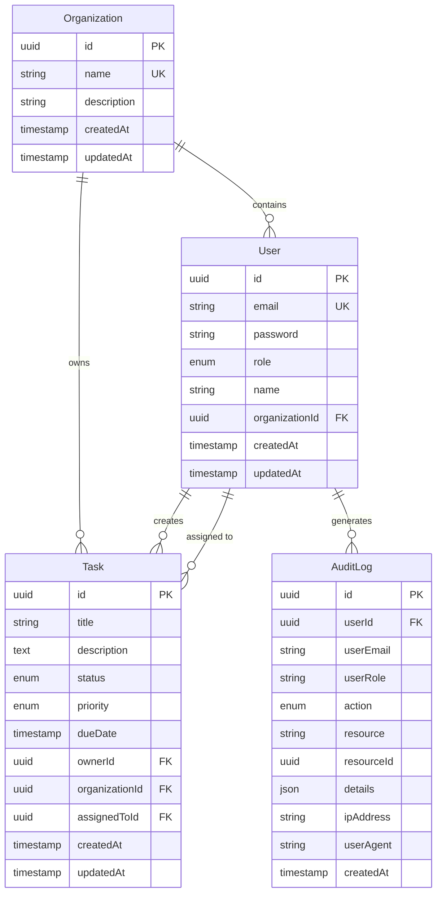

# RBAC Implementation Documentation

## Overview

This document describes the complete Role-Based Access Control (RBAC) implementation for the Company Assessment backend API. The system implements secure, JWT-based authentication with granular permission controls, organizational isolation, and comprehensive audit logging.

## Table of Contents

1. [Architecture Overview](#architecture-overview)
2. [Roles and Permissions](#roles-and-permissions)
3. [Entity Relationships](#entity-relationships)
4. [Access Control Logic](#access-control-logic)
5. [API Endpoints](#api-endpoints)
6. [Testing Guide](#testing-guide)
7. [Security Features](#security-features)

---

## Architecture Overview

### Technology Stack
- **Framework**: NestJS 11.0.0
- **Database**: PostgreSQL (with SQLite fallback)
- **ORM**: TypeORM 0.3.27
- **Authentication**: JWT with Passport.js
- **Password Hashing**: bcrypt

### Key Components

```
apps/api/src/app/
├── entities/
│   ├── organization.entity.ts    # Organization model
│   ├── task.entity.ts            # Task model with ownership
│   └── audit-log.entity.ts       # Audit logging
├── enums/
│   └── permission.enum.ts        # Permission definitions & role mapping
├── auth/
│   ├── guards/
│   │   ├── jwt-auth.guard.ts     # JWT authentication
│   │   ├── permissions.guard.ts  # Permission-based authorization
│   │   └── ownership.guard.ts    # Resource ownership verification
│   └── decorators/
│       ├── permissions.decorator.ts   # @RequirePermissions()
│       └── current-user.decorator.ts  # @CurrentUser()
├── services/
│   ├── rbac.service.ts           # RBAC business logic
│   └── audit-log.service.ts      # Audit logging service
├── interceptors/
│   └── audit-log.interceptor.ts  # Auto-logging interceptor
├── tasks/
│   └── [TasksModule]             # Task CRUD with RBAC
└── organizations/
    └── [OrganizationsModule]     # Organization management
```

---

## Roles and Permissions

### Role Hierarchy

The system implements three roles with inheritance:

```
OWNER (Highest)
  ↓ Inherits all permissions
ADMIN
  ↓ Inherits limited permissions
VIEWER (Lowest)
```

### Role Definitions

#### 1. OWNER
**Description**: Full control over the organization and all resources.

**Permissions**:
- All task operations (create, read all, update all, delete all)
- All user management (create, read, update, delete)
- Organization management (create, read, update, delete)

**Restrictions**:
- Cannot change own role
- Cannot remove self from organization

#### 2. ADMIN
**Description**: Can manage tasks and users, but not organization settings.

**Permissions**:
- All task operations (create, read all, update all, delete all)
- User management (create, read, update)
- Organization read access

**Restrictions**:
- Cannot modify organization settings
- Cannot delete users
- Can only manage users within their organization

#### 3. VIEWER
**Description**: Standard user with limited access to own resources.

**Permissions**:
- Create tasks
- Read own tasks (tasks they own or are assigned to)
- Update own tasks
- Delete own tasks
- Organization read access

**Restrictions**:
- Cannot access other users' tasks
- Cannot manage users
- Cannot modify organization settings

### Permission Matrix

| Permission | OWNER | ADMIN | VIEWER |
|------------|-------|-------|--------|
| `task:create` | ✓ | ✓ | ✓ |
| `task:read:all` | ✓ | ✓ | ✗ |
| `task:read:own` | ✓ | ✓ | ✓ |
| `task:update:all` | ✓ | ✓ | ✗ |
| `task:update:own` | ✓ | ✓ | ✓ |
| `task:delete:all` | ✓ | ✓ | ✗ |
| `task:delete:own` | ✓ | ✓ | ✓ |
| `user:create` | ✓ | ✓ | ✗ |
| `user:read` | ✓ | ✓ | ✗ |
| `user:update` | ✓ | ✓ | ✗ |
| `user:delete` | ✓ | ✗ | ✗ |
| `org:manage` | ✓ | ✗ | ✗ |
| `org:read` | ✓ | ✓ | ✓ |

---

## Entity Relationships

### Database Schema



### Entity Details

#### Organization
- **Purpose**: Isolates resources and users
- **Key Fields**: name (unique), description
- **Relationships**: Has many users and tasks

#### User
- **Purpose**: System user with role and organization membership
- **Key Fields**: email (unique), password (bcrypt hashed), role
- **Relationships**: Belongs to one organization

#### Task
- **Purpose**: Work items with ownership and assignment
- **Key Fields**: title, status, priority, dueDate
- **Relationships**:
  - Belongs to one organization
  - Has one owner (User)
  - Can be assigned to one user (User)

#### AuditLog
- **Purpose**: Immutable audit trail of all actions
- **Key Fields**: action, resource, resourceId, details
- **Indexed**: userId, action, createdAt, resource+resourceId

---

## Access Control Logic

### 1. Authentication Flow

```
1. User sends POST /api/auth/login with credentials
2. AuthService validates email/password
3. JWT token generated with payload: { sub: userId, email, role }
4. Token returned to client
5. Client includes token in Authorization header: Bearer <token>
6. JwtAuthGuard validates token on protected routes
7. User object attached to request
```

### 2. Authorization Flow

```
1. Request hits protected endpoint
2. JwtAuthGuard authenticates user
3. PermissionsGuard checks required permissions
4. OwnershipGuard verifies resource access (if applicable)
5. Request proceeds to controller/service
6. Service performs business logic with additional checks
7. AuditLogInterceptor logs the action
```

### 3. Guards and Decorators

#### Using Guards

```typescript
@Controller('tasks')
@UseGuards(JwtAuthGuard, PermissionsGuard)
export class TasksController {
  @Get()
  @RequirePermissions(Permission.TASK_READ_OWN)
  findAll(@CurrentUser() user: User) {
    // Only authenticated users with task:read:own permission
  }
}
```

#### Available Decorators

- `@RequirePermissions(...permissions)`: Specify required permissions
- `@CurrentUser()`: Inject authenticated user into route handler
- `@UseInterceptors(AuditLogInterceptor)`: Enable audit logging

### 4. Organizational Isolation

All resources are scoped to organizations:

1. **Task Visibility**:
   - OWNER/ADMIN: See all tasks in their organization
   - VIEWER: See only tasks they own or are assigned to

2. **User Management**:
   - OWNER: Manage all users in organization
   - ADMIN: View and create users in organization
   - VIEWER: Cannot manage users

3. **Cross-Organization Access**:
   - Strictly forbidden
   - All queries filtered by `organizationId`
   - Guards verify organization membership

### 5. Role Inheritance Logic

Implemented in `RbacService`:

```typescript
// Check if user can manage another role
canManageRole(managerRole: UserRole, targetRole: UserRole): boolean {
  const roleHierarchy = {
    OWNER: 3,
    ADMIN: 2,
    VIEWER: 1,
  };
  return roleHierarchy[managerRole] > roleHierarchy[targetRole];
}
```

**Rules**:
- OWNER can manage ADMIN and VIEWER
- ADMIN can manage VIEWER
- VIEWER cannot manage anyone
- Users cannot change their own role

---

## API Endpoints

### Authentication

#### Login
```http
POST /api/auth/login
Content-Type: application/json

{
  "email": "user@example.com",
  "password": "password123"
}

Response:
{
  "access_token": "eyJhbGciOiJIUzI1NiIsInR5cCI6IkpXVCJ9..."
}
```

### Organizations

#### Create Organization
```http
POST /api/organizations
Authorization: Bearer <token>
Content-Type: application/json

{
  "name": "Acme Corp",
  "description": "Main organization"
}
```

#### Get Organization
```http
GET /api/organizations/:id
Authorization: Bearer <token>
```

#### Update Organization (OWNER only)
```http
PATCH /api/organizations/:id
Authorization: Bearer <token>
Content-Type: application/json

{
  "name": "Updated Name"
}
```

#### Get Organization Users
```http
GET /api/organizations/:id/users
Authorization: Bearer <token>
```

#### Add User to Organization (OWNER/ADMIN)
```http
POST /api/organizations/:id/users/:userId
Authorization: Bearer <token>
Content-Type: application/json

{
  "role": "VIEWER"
}
```

#### Update User Role (OWNER only)
```http
PATCH /api/organizations/:id/users/:userId/role
Authorization: Bearer <token>
Content-Type: application/json

{
  "role": "ADMIN"
}
```

#### Remove User from Organization (OWNER only)
```http
DELETE /api/organizations/:id/users/:userId
Authorization: Bearer <token>
```

### Tasks

#### Create Task
```http
POST /api/tasks
Authorization: Bearer <token>
Content-Type: application/json

{
  "title": "Complete RBAC implementation",
  "description": "Implement role-based access control",
  "status": "TODO",
  "priority": "HIGH",
  "dueDate": "2025-10-20T00:00:00Z",
  "assignedToId": "uuid-of-user"
}
```

#### Get All Tasks
```http
GET /api/tasks
Authorization: Bearer <token>

# OWNER/ADMIN: Returns all organization tasks
# VIEWER: Returns only tasks they own or are assigned to
```

#### Get Task by ID
```http
GET /api/tasks/:id
Authorization: Bearer <token>
```

#### Get Tasks by Status
```http
GET /api/tasks/status/:status
Authorization: Bearer <token>

# Available statuses: TODO, IN_PROGRESS, COMPLETED
```

#### Update Task
```http
PATCH /api/tasks/:id
Authorization: Bearer <token>
Content-Type: application/json

{
  "status": "IN_PROGRESS",
  "priority": "URGENT"
}
```

#### Delete Task
```http
DELETE /api/tasks/:id
Authorization: Bearer <token>
```

---

## Testing Guide

### Setup

1. **Start PostgreSQL**:
```bash
# Using Docker
docker run --name postgres-rbac -e POSTGRES_PASSWORD=postgres -p 5432:5432 -d postgres

# Or set environment variables for existing PostgreSQL
export DB_TYPE=postgres
export DB_HOST=localhost
export DB_PORT=5432
export DB_USER=postgres
export DB_PASSWORD=postgres
export DB_NAME=company_db
```

2. **Start the API**:
```bash
cd company-workspace
npm install
npx nx serve api
```

The API will start on `http://localhost:3000/api`

### Test Scenarios

#### Scenario 1: Organization Setup

```bash
# 1. Login as default admin user (created by seed)
curl -X POST http://localhost:3000/api/auth/login \
  -H "Content-Type: application/json" \
  -d '{"email":"vindrajit1996@gmail.com","password":"Admin@1234"}'

# Save the token
TOKEN="<access_token_from_response>"

# 2. Create an organization
curl -X POST http://localhost:3000/api/organizations \
  -H "Authorization: Bearer $TOKEN" \
  -H "Content-Type: application/json" \
  -d '{"name":"Test Corp","description":"Test organization"}'

# Save organization ID
ORG_ID="<id_from_response>"
```

#### Scenario 2: Task Management (VIEWER)

```bash
# 1. Create a task as VIEWER
curl -X POST http://localhost:3000/api/tasks \
  -H "Authorization: Bearer $TOKEN" \
  -H "Content-Type: application/json" \
  -d '{
    "title":"My First Task",
    "description":"Test task",
    "status":"TODO",
    "priority":"MEDIUM"
  }'

# 2. Get all tasks (VIEWER sees only their own)
curl -X GET http://localhost:3000/api/tasks \
  -H "Authorization: Bearer $TOKEN"

# 3. Update task
curl -X PATCH http://localhost:3000/api/tasks/<task_id> \
  -H "Authorization: Bearer $TOKEN" \
  -H "Content-Type: application/json" \
  -d '{"status":"IN_PROGRESS"}'
```

#### Scenario 3: Role-Based Access

```bash
# As VIEWER, try to access another user's task (should fail)
curl -X GET http://localhost:3000/api/tasks/<other_user_task_id> \
  -H "Authorization: Bearer $TOKEN"
# Expected: 403 Forbidden

# As ADMIN, access all tasks in organization (should succeed)
# First, get admin token...
# Then:
curl -X GET http://localhost:3000/api/tasks \
  -H "Authorization: Bearer $ADMIN_TOKEN"
# Expected: All organization tasks
```

#### Scenario 4: User Management

```bash
# As OWNER, add user to organization
curl -X POST http://localhost:3000/api/organizations/$ORG_ID/users/<user_id> \
  -H "Authorization: Bearer $TOKEN" \
  -H "Content-Type: application/json" \
  -d '{"role":"VIEWER"}'

# As OWNER, update user role
curl -X PATCH http://localhost:3000/api/organizations/$ORG_ID/users/<user_id>/role \
  -H "Authorization: Bearer $TOKEN" \
  -H "Content-Type: application/json" \
  -d '{"role":"ADMIN"}'

# As ADMIN, try to remove user (should fail)
curl -X DELETE http://localhost:3000/api/organizations/$ORG_ID/users/<user_id> \
  -H "Authorization: Bearer $ADMIN_TOKEN"
# Expected: 403 Forbidden
```

### Expected Behaviors

| Action | OWNER | ADMIN | VIEWER |
|--------|-------|-------|--------|
| View all org tasks | ✓ | ✓ | ✗ (only own) |
| View own tasks | ✓ | ✓ | ✓ |
| Create tasks | ✓ | ✓ | ✓ |
| Update any task | ✓ | ✓ | ✗ (only own) |
| Delete any task | ✓ | ✓ | ✗ (only own) |
| Add users | ✓ | ✓ | ✗ |
| Remove users | ✓ | ✗ | ✗ |
| Change roles | ✓ | ✗ | ✗ |
| Modify org settings | ✓ | ✗ | ✗ |

---

## Security Features

### 1. JWT-Based Authentication

- **Token Expiration**: 24 hours (configurable)
- **Secret**: Environment variable `JWT_SECRET`
- **Payload**: `{ sub: userId, email, role }`
- **Storage**: Client-side (localStorage/sessionStorage)

### 2. Password Security

- **Algorithm**: bcrypt
- **Rounds**: 10
- **Validation**: Minimum 8 characters (configurable)

### 3. Audit Logging

All actions are logged to the `audit_logs` table:

```typescript
{
  userId: string,
  userEmail: string,
  userRole: string,
  action: AuditAction, // LOGIN, TASK_CREATE, etc.
  resource: string,
  resourceId: string,
  details: object,
  ipAddress: string,
  userAgent: string,
  createdAt: Date
}
```

**Logged Actions**:
- Authentication (login, logout, failed attempts)
- Task operations (create, read, update, delete)
- User operations (create, read, update, delete, role changes)
- Organization operations (create, read, update, delete)
- Access denied events

**Audit Log Access**:
```typescript
// Get audit logs (implementation in AuditLogService)
async getAuditLogs(filters?: {
  userId?: string;
  action?: AuditAction;
  resource?: string;
  startDate?: Date;
  endDate?: Date;
  limit?: number;
}): Promise<AuditLog[]>
```

### 4. Organizational Isolation

- All queries filtered by `organizationId`
- Cross-organization access prevented at guard level
- Database-level foreign key constraints
- Cascade deletes for data integrity

### 5. Input Validation

Using class-validator decorators:

```typescript
class CreateTaskDto {
  @IsString()
  @IsNotEmpty()
  title: string;

  @IsEnum(TaskStatus)
  @IsOptional()
  status?: TaskStatus;

  @IsUUID()
  @IsOptional()
  assignedToId?: string;
}
```

### 6. Error Handling

- **Authentication Errors**: 401 Unauthorized
- **Authorization Errors**: 403 Forbidden
- **Not Found**: 404 Not Found
- **Validation Errors**: 400 Bad Request
- **Conflict Errors**: 409 Conflict

### 7. Protection Against Common Attacks

- **SQL Injection**: TypeORM parameterized queries
- **XSS**: Input validation and sanitization
- **CSRF**: Stateless JWT (no cookies)
- **Brute Force**: Rate limiting (recommended to add)
- **Timing Attacks**: bcrypt constant-time comparison

---

## Best Practices

### 1. Token Management
- Store JWT securely (httpOnly cookies or secure storage)
- Implement token refresh mechanism
- Clear tokens on logout

### 2. Error Messages
- Avoid leaking sensitive information
- Use generic messages for authentication failures
- Log detailed errors server-side only

### 3. Audit Trail
- Review audit logs regularly
- Monitor for suspicious activity
- Retain logs for compliance

### 4. Role Assignment
- Follow principle of least privilege
- Assign VIEWER by default
- Require approval for ADMIN/OWNER roles

### 5. Database Security
- Use environment variables for credentials
- Enable SSL for production databases
- Regular backups
- Disable synchronize in production

---

## Future Enhancements

1. **Fine-Grained Permissions**
   - Custom permission sets per user
   - Team-based permissions
   - Resource-level ACLs

2. **Advanced Features**
   - Two-factor authentication (2FA)
   - Single Sign-On (SSO)
   - API rate limiting
   - Token refresh mechanism

3. **Audit Improvements**
   - Real-time audit alerts
   - Compliance reports
   - Data retention policies

4. **Multi-Tenancy**
   - Multiple organizations per user
   - Organization hierarchy
   - Cross-organization collaboration

---

## Troubleshooting

### Common Issues

#### 1. "User not authenticated"
- Check token is included in Authorization header
- Verify token hasn't expired
- Check JWT_SECRET matches

#### 2. "You do not have required permissions"
- Verify user role has required permission
- Check permission enum values
- Review ROLE_PERMISSIONS mapping

#### 3. "Organization not found"
- Ensure user belongs to an organization
- Check organizationId in user record
- Verify organization exists in database

#### 4. Database connection errors
- Verify PostgreSQL is running
- Check environment variables
- Review database.config.ts

---

## Summary

This RBAC implementation provides:

✅ **Three-tier role system** (OWNER, ADMIN, VIEWER)
✅ **Permission-based authorization** with role inheritance
✅ **Organizational isolation** for multi-tenant support
✅ **Resource-level access control** (ownership & assignment)
✅ **Comprehensive audit logging** (console & database)
✅ **JWT-based authentication** with bcrypt password hashing
✅ **Secure guards and decorators** for route protection
✅ **RESTful API** with complete CRUD operations

The system is production-ready with proper error handling, validation, and security best practices.
